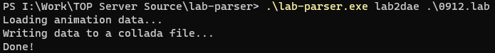

# Lab Parser

This tool is made to convert animation files used in the game [Tales of Pirates](https://en.wikipedia.org/wiki/Tales_of_Pirates) to a format that is easily consumable by modern 3D animation software such as Blender. The converted file can then be used to create new animations and poses for character models being used in the game.

## Usage

The tool currently offers one option - `lab2dae`. 

This can be used to convert .lab files to .dae (collada) files.

The collada file can then be imported into Blender in order to look at and modify the bone structure and animations for all character models.

<video width="600" height="500" autoplay looped muted>
  <source src="static/blender.mp4" >
</video>

You can use this option by providing the following arguments to the program -

1st argument: operation type. currently supported - `lab2dae`

2nd argument: file location. currently supported - `.lab` file formats

## On-going work

I'm currently working to support reverse-conversions, so that the updated model can then be converted back to the `.lab` format and be used in the game directly.

I'm also working on ways to add some more data to the collada file, so that we can look at the full textured model within the 3D animation software.

Example: 

This is the same .lab file as the previous video, with mesh and texture information added into the collada file.

<video width="600" height="500" autoplay looped muted>
  <source src="static/textured.mp4" >
</video>